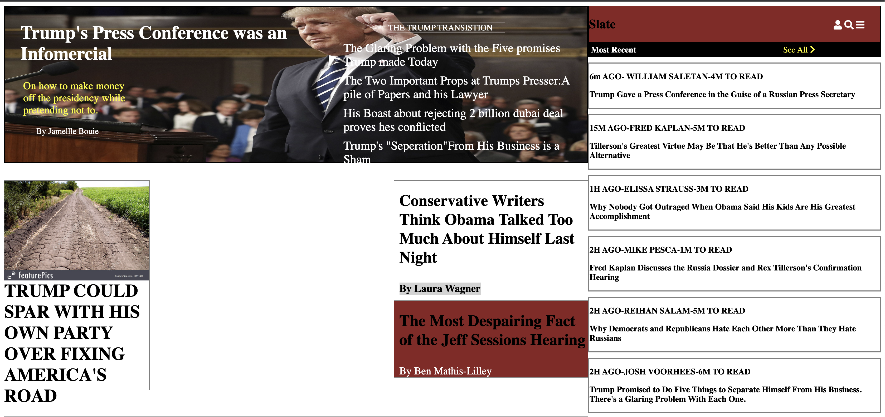

# Slate

A recreation of the Slate website

## Link to my site:

https://zikreslate.netlify.com

## How It's Made:

## Tech Used:

HTML, CSS

I attempted to recreate the slate site pixel for pixel.

## Lesssons Learned:

Using CSS is a challenge and one that I can only overcome with repeated practice.

## Examples:

https://github.com/zikrehaimanot/todo-list-2019-week05/tree/answer

https://github.com/zikrehaimanot/calculator

https://github.com/zikrehaimanot/rpsGame

https://github.com/zikrehaimanot/foodist

https://github.com/zikrehaimanot/fizzbuzz
